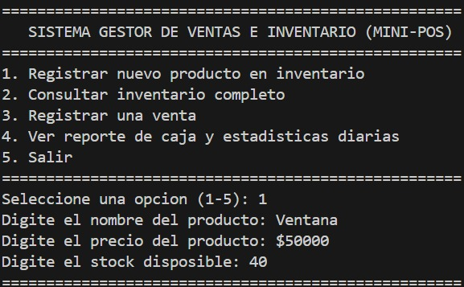
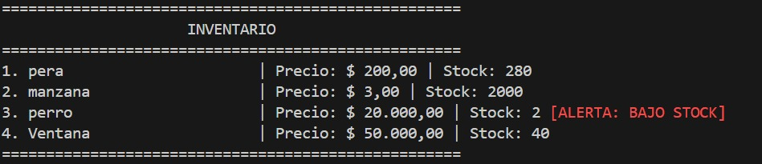
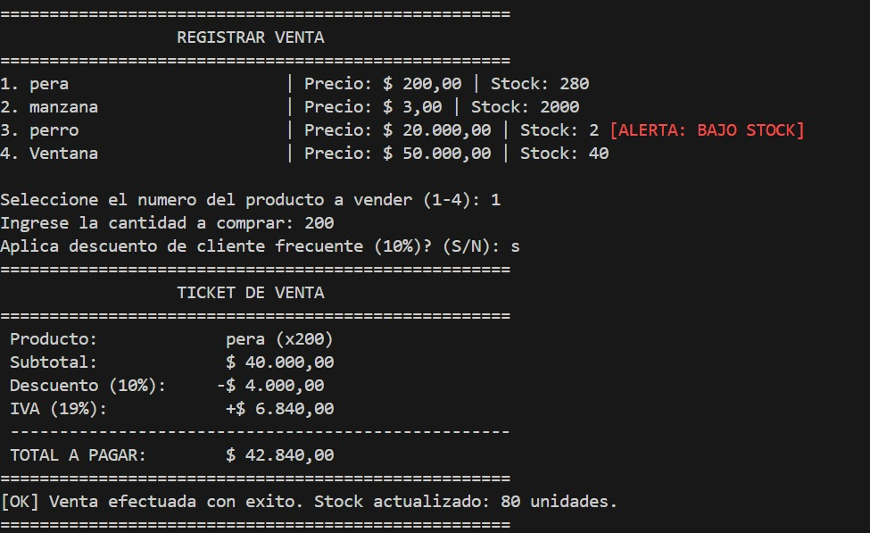
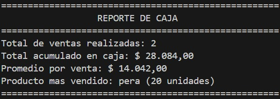

# Sistema Gestor de Ventas e Inventario Express (Mini-POS)

**Estudiante:** Edinso Barros Lopez  
**Módulo:** Unidad 1 — Fundamentos de C# (.NET 8)

---

## Descripción

Aplicación de consola desarrollada en **C# (.NET 8)** que simula un punto de venta e inventario básico para una tienda local. Permite registrar productos, consultar el inventario, procesar ventas aplicando IVA (19%) y descuento por cliente frecuente (10%), y consultar un reporte de caja con las estadísticas de la sesión.

El proyecto utiliza únicamente los conceptos de la **Unidad 1**:
* Variables y tipos primitivos
* Colecciones (`List<T>`)
* Estructuras de control
* Métodos estáticos
* Manejo seguro de errores con `TryParse`

> **Nota:** No se implementa Programación Orientada a Objetos (clases personalizadas) ni bases de datos; toda la información se maneja en memoria durante la ejecución.

---

## Demostración
#### Registro de productos:

#### Consulta de inventario:

#### Registrar una venta:

#### Reporte Caja:


---

## Funcionalidades

* **Registro de productos:** Validación de nombre único, precio mayor a cero y stock no negativo.
* **Consulta del inventario:** Listado completo con alerta de bajo stock (menos de 5 unidades).
* **Registro de ventas:** Validación de stock disponible, cálculo automático de subtotal, descuento, IVA y total, y generación de ticket en pantalla.
* **Reporte de caja:** Estadísticas con total de ventas, dinero acumulado, promedio por venta y producto más vendido.

---

## Requisitos

* **.NET 8 SDK** instalado — [Descargar .NET 8](https://dotnet.microsoft.com/download/dotnet/8.0)

---

## Cómo clonar y ejecutar

Clona el repositorio, entra a la carpeta y ejecuta estos tres comandos:

```bash
git clone [https://github.com/Elobar/parcialElectiva](https://github.com/Elobar/parcialElectiva)
cd parcialElectiva
dotnet run
